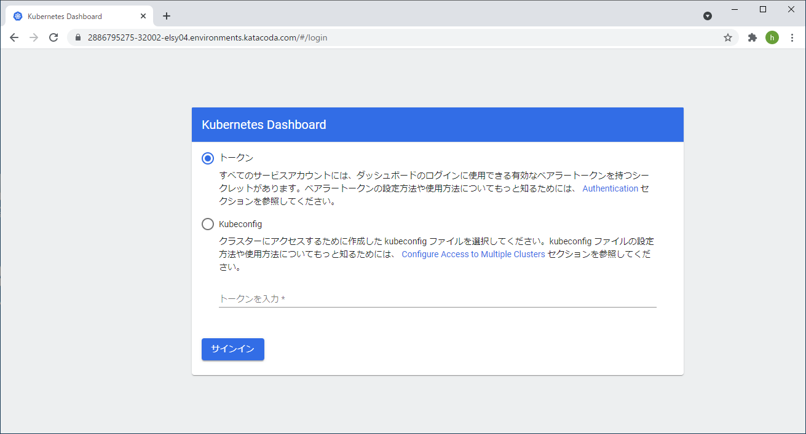

# ダッシュボードの外部ノードからアクセス
**<span style="color: red; ">【masterノード（controlplane）で実施】</span>**  

masterノードのポートを使用して、外部ノードからアクセス出来るようにします。  

①Podの状態からダッシュボードのみを表示します。  
$ `kubectl get pods --all-namespaces | grep dashboard`{{execute}}  
<br>

②ダッシュボードの定義ファイルを編集します。  
$ `kubectl -n kubernetes-dashboard edit service kubernetes-dashboard`{{execute HOST1}}  

```yaml
(省略）
spec:
(省略）
  ports:
  - port: 443
    protocol: TCP
    targetPort: 8443
    nodePort: 32002 <- nodePortを追加します（任意のポートを指定します。 例：32002）
(省略)
  type: ClusterIP <- この行を削除し、下記の行「type: NodePort」を追加します。
  type: NodePort
(省略)
```  
③サービスの状態を取得し、確認します。  

$ `kubectl get svc --all-namespaces`{{execute}}  

**（表示例）**
```
kubernetes-dashboard  kubernetes-dashboard    NodePort    yyy.yyy.yyy.yyy  <none>      443:32002/TCP   16m
```
④ポート：32002で表示を確認します。  

ブラウザからのアクセスは以下の通り。（例：「xxx.xxx.xxx.xxx」はmasterノードのIPアドレスです。）  
`https://xxx.xxx.xxx.xxx:32002`  
<br>

**KillercodaのWebアクセス方法：**  
①ターミナルペインの「**Tab1**」「**＋**」のタグの並びの一番左にある「**三**」をクリックする。  
②表示されるドロップリストから「**Traffic / Ports**」をクリックする。
③新しいブラウザタブ「**Traffic Port Accessor**」が表示されたら、「**Custom Ports**」の下のボックスに「**32002**」を入力し、「**Access**」をクリックします。  

**（表示例）**  
  
