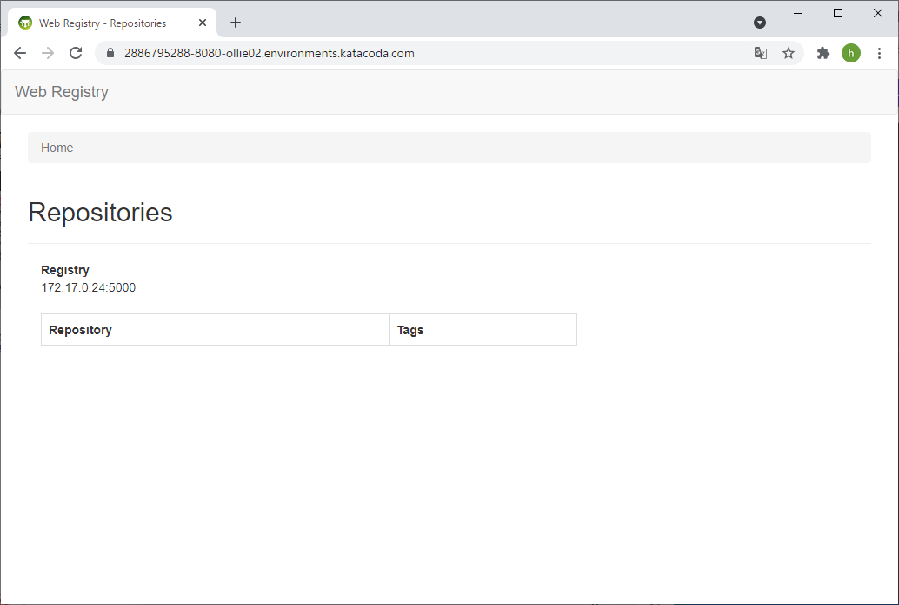

# プライベートレジストリのWeb-UIの構築
プライベートレジストリで管理されているコンテナイメージの参照・削除などはWeb-UIを構築することで可能となります。  

<u>**※このステップは本レッスンでは実施しません。**</u>  
 

**【registryノードで実施】**  

①プライベートレジストリのWeb-UIのコンテナイメージをパブリックレジストリからpullします。  
\# `docker pull hyper/docker-registry-web`  

②パラメータを指定して、Web-UIのコンテナイメージを起動します。（「xxx.xxx.xxx.xxx」はregistryノードのIPアドレスを指定します）  

\# `docker run -d -p 8080:8080 -e REGISTRY_URL=http://xxx.xxx.xxx.xxx:5000/v2 -e REGISTRY_NAME=xxx.xxx.xxx.xxx:5000 -e REGISTRY_READONLY=false hyper/docker-registry-web:latest`   

④ブラウザからアクセスする場合のURLは下記の通りです。  

`http://xxx.xxx.xxx.xxx:8080`  

**（表示例）**  
  