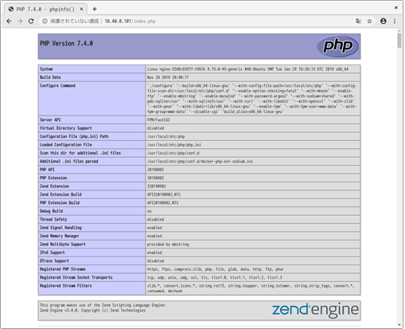

# kubernetes上のpodの動作確認

ブラウザでアドレスを指定して表示を確認します。

- nginxのwelcomeメッセージが表示されることを確認します。  

  ブラウザからのアクセスは以下の通りです。（例：「xxx.xxx.xxx.xxx」はmasterノードのIPアドレスです。）  
  `https://xxx.xxx.xxx.xxx:31001`  

  **KatacodaのWebアクセス方法：**  
  ①ターミナルペインの「**Terminal Host 1**」のタグの隣の「**＋**」をクリックします。  
  ②表示されるドロップリストから「**Select port to view on Host 1**」をクリックします。  
  ③ボックスに「**31001**」を入力し、「**Display Port**」をクリックします。  

**（表示例）**  
  

- 現在アクセス中のPodの名前が表示されることを確認します。  

  ブラウザからのアクセスは以下の通りです。（例：「xxx.xxx.xxx.xxx」はmasterノードのIPアドレスです。）
  `https://xxx.xxx.xxx.xxx:31001/test.php`  

  **KatacodaのWebアクセス方法：**  
  ①ターミナルペインの「**Terminal Host 1**」のタグの隣の「**＋**」をクリックします。  
  ②表示されるドロップリストから「**Select port to view on Host 1**」をクリックします。  
  ③ボックスに「**31001**」を入力し、「**Display Port**」をクリックします。  
  ④ブラウザのURLの末尾に「/test.php」を追加すると、アクセス中のPodの名前が表示される。  

**（表示例）**  

  

- phpの情報が表示されることを確認します。  

  ブラウザからのアクセスは以下の通りです。（例：「xxx.xxx.xxx.xxx」はmasterノードのIPアドレスです。）
  `https://xxx.xxx.xxx.xxx:31001/index.php`  

  **KatacodaのWebアクセス方法：**  
  ①ターミナルペインの「**Terminal Host 1**」のタグの隣の「**＋**」をクリックします。  
  ②表示されるドロップリストから「**Select port to view on Host 1**」をクリックします。  
  ③ボックスに「**31001**」を入力し、「**Display Port**」をクリックします。
  ④ブラウザのURLの末尾に「/index.php」を追加すると、php情報（phpinfo()）が表示される。  

**（表示例）**  

  

