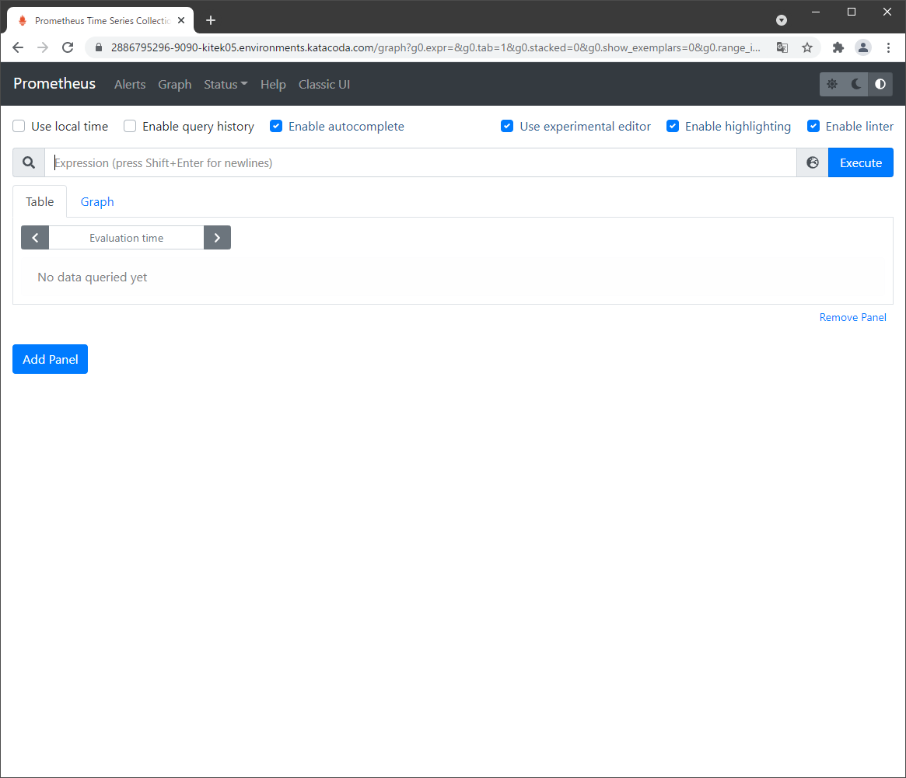
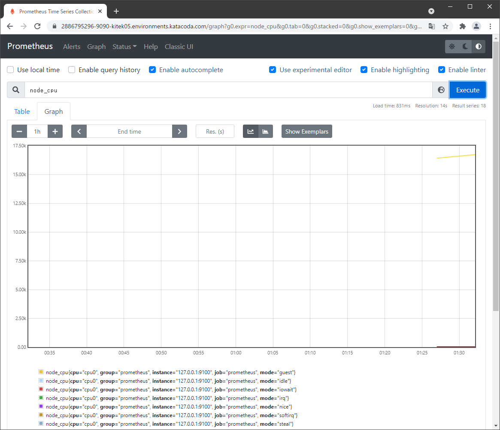

# 観測値の表示#1
コンテナが起動すると、prometheusは構成の内部に基づいてデータを取得し、格納します。  

- ダッシュボードのグラフページにアクセスしてください。  
https://localhost:9090/graph

**KatacodaのWebアクセス方法：**  
①ターミナルペインの「**Terminal Host 1**」のタグの隣の「**＋**」をクリックします。  
②表示されるドロップリストから「**Select port to view on Host 1**」をクリックします。  
③ボックスに「**9090**」を入力し、「**Display Port**」をクリックします。  

**（表示例）**  
  
 

基になるメトリックをクエリ（補足：クエリ＝要求）してグラフを作成するには、ダッシュボードのグラフページにアクセスしてください。ここから、名前に基づいてさまざまなメトリックを照会できます。  

たとえば、「node_network_receive_bytes」をクエリすると、ディスクIOがどの程度アクティブであるかがわかります。 「node_cpu」を使用してクエリを実行すると、Docker Hosts CPU情報が出力されます。  

- クエリ（虫眼鏡マーク）に該当の言葉（「node_network_receive_bytes」等）を入力し、「Execute」→下部のタグ「Graph」をクリックする。

**（表示例）**  
node_network_receive_bytes  
  

node_cpu  
  